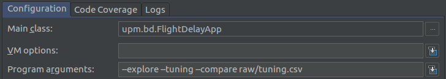

# SparkML

Master EIT Data Science @UPM. Big Data assignment.

## Getting started

The best way to run this project is by importing it as a Maven project in your favorite IDE,
otherwise you will need to install Spark or create a fat jar with the Spark dependencies
included using the `mvn package` command.

The main class of the application receives the dataset to process as a parameter. You can
find multiple valid datasets at this link: http://stat-computing.org/dataexpo/2009/the-data.html

By default, the applications evaluates a Linear Regression model on the given dataset. You
can add some flags to trigger other stages:

* `--explore`: compute some statistics on the dataset (e.g., flights by carrier,
cancelled flights).
* `--tuning`: obtain the best set of parameters (e.g., elasticNetParam, regParam)
for different algorithms (for the moment, Linear Regression and Random Forest).
* `--compare`: compare different algorithms using the best parameters for each
one (the parameters are hardcoded, shame on us).

Be aware that the tuning and the compare stages are going to take a lot of time with
a large dataset (14 models are trained with 10 folds cross validation). This is why we
included a `tuning.csv` file in the `raw` folder. Please, consider to use this dataset when 
you provide either the `--tuning` or `--compare` flag.

This is one possible run configuration that you can add in your IDE:



This is the output of the tuning stage:


This is the output of the compare stage:


### Running the app with `spark-submit`

You can generate the jar file executing `mvn package`. This will generate a binary file
you can submit using `spark-submit` command. Ensure your local Spark version is Spark 2.2.0.

Since we are using a an open source logging template to add color to the output, it's necessary
to read the `log4.properties` included in the jar file. Use this command:

```
spark-submit \
--conf "spark.executor.extraJavaOptions=-Dlog4j.configuration=log4j.properties" \
--conf "spark.driver.extraJavaOptions=-Dlog4j.configuration=log4j.properties" \
--driver-class-path jars/SparkML-1.0-SNAPSHOT-jar-with-dependencies.jar \
--class upm.bd.FlightDelayApp jars/SparkML-1.0-SNAPSHOT-jar-with-dependencies.jar \
--tuning raw/tuning.csv
```

## Validation process

//TODO

## Authors :es: :blue_heart: :it:

* **Fernando Díaz**
* **Giorgio Ruffa**

## License

This project is licensed under the MIT License - see the [LICENSE.md](LICENSE.md) file for details
